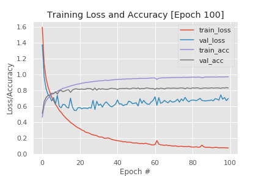

### Project 13- Training Monitor for Under/Over-fit Detection

    

Description:

This repository contains Python source that implements an image
 classification software by training the MinVGGNet CNN architecture on the
  Cifar10 dataset. However, the primary aim of this project is the
   implementation of custom Training Monitor callbacks within the Keras
    library that allow the logging and plotting of near real time training
     and validation loss and accuracies that can be used to detect near real
      time over and under fitting as training epochs are running.  
       

Technology Used:

* Python 3

Libraries Used:

* numpy
* seaborn
* sklearn
* Keras
