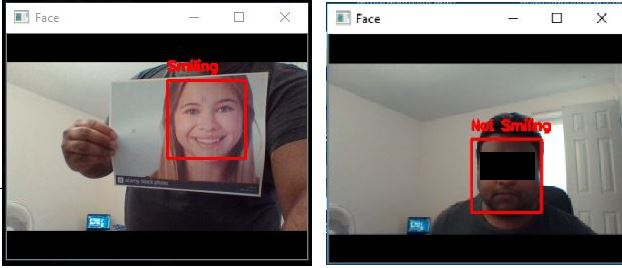

### Project 15- Pretrained Model Implementation 

    

Description:

This repository contains 2 Python scripts that serve as source codes for:
 
 (i) 
The implementation of a training script that trains a LeNet architecture
 Convoluted Neural Network model on the Smiles dataset that contains 13651
  images of human faces categorised into either smiling or non-smiling faces
   and 
   
   (ii) The implementation of a detector script that grabs frames in
    realtime from a web-cam and detects as to whether the face of the person
     sitting infront of the camera is smiling or not based on the OpenCV
      HAAR cascade algorithm for face detection and the previously trained
       CNN model in step (i) to detect smiling faces.
       
A sample of the camera capture outputs for smiling and non smiling faces
 is shown below:
 
 

    

        
       
The dataset and the main template for the code are courtesy of [Dr. Adrian
 Rosebrock](https://www.linkedin.com/in/adrian-rosebrock-59b8732a/).
       
    
       

Technology Used:

* Python 3

Libraries Used:

* numpy
* seaborn
* Keras
* OpenCV
