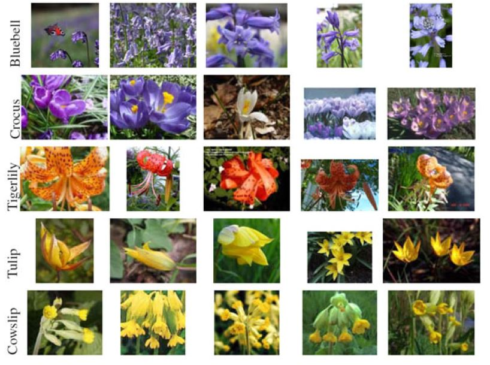
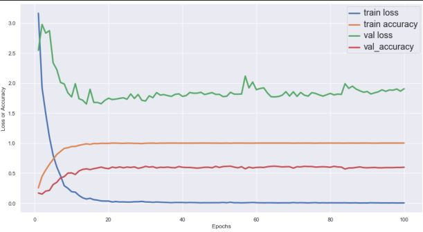
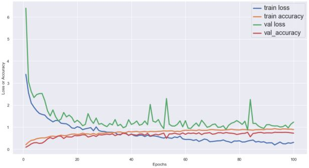

### Project 18- Effect of Data Augmentation on CNN 

    

Description:

This repository contains 2 Jupyter files that serve as source codes
 demonstrating the effect of Data Augmentation on CNN training accuracy. A
  MinVGGNet CNN architecture was trained on a dataset containing 17
   categories of flower species:
   
   

    

Owing to the lower number of training samples per class of flower species, a
 low accuracy of around 60% was obtained on the un-altered dataset with a
  large degree of train data overfitting shown by the 100% training accuracy
   below:

    

Subsequently, data augmentation routine was employed on the dataset to
 impose random rotation, width and height shifts, shear distortion and zoom
  to allow the model to generalise better on test data. Consequently, an
   improved test accuracy of around 75% was obtained as can be seen through
    the training curve on the augmented dataset below:
    
 

    

Technology Used:

* Python 3

Libraries Used:

* numpy
* seaborn
* Keras
* OpenCV
