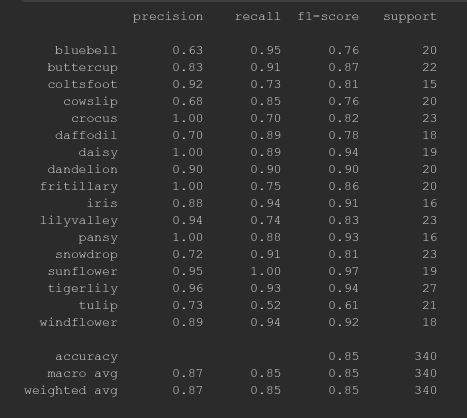
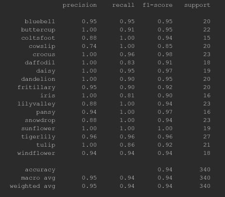

### Project 20- Transfer Learning Using VGG16 Architecture

    

Description:

This repository contains Python script that serves as source code for:

 * The implementation of a training script that trains a fully connected
  layer using a pre-trained VGG16 architecture precursor on the Flowers-17
   dataset. The training occurs over a period of 25 epochs and a final model
    accuracy of around 85% is obtained for a Imagenet trained precursor as
     shown below.
    
    

    
     

   

 * Once the fully connected layer is trained over a routine of 25 epochs
 , some of the earlier ConvNet layers of the precursor are unfrozen and the
  backpropagation is allowed to traverse through them over a period of 100
   epochs to allow the attainment of even higher accuracy of around 95% as
    shown below.  

    

Technology Used:

* Python 3

Libraries Used:

* numpy
* seaborn
* Keras
* OpenCV
