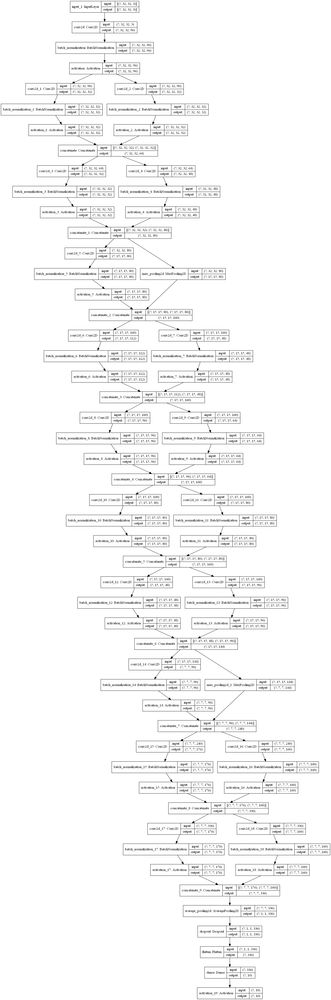
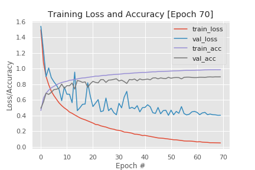

### Project 23- MiniGoogLeNet on Cifar10

    

Description:

This repository contains a Jupyter notebook that serve as source code for:

 
The implementation of a custom MiniGoogLeNet architecture inspired by [Zhang
 et. al](https://arxiv.org/pdf/1611.03530.pdf). This architecture is
  composed of [inception](https://arxiv.org/pdf/1409.4842.pdf) modules that
   allow for the attainment of better model accuracy on the Cifar10 dataset
   . The inset above shows the overall architecture of the model. The model
    was trained for 70 epochs and a final accuracy of around 89% was
     obtained on the validation set.

    

The training curves above show presence of significant model overfitting on
 the training data but it is an unavoidable reality of such a deep model on
  the cifar10 dataset.

The main template for the code are courtesy of [Dr. Adrian
 Rosebrock](https://www.pyimagesearch.com/).

Technology Used:
* Python 3

Libraries Used:

* numpy
* seaborn
* Keras
* OpenCV
