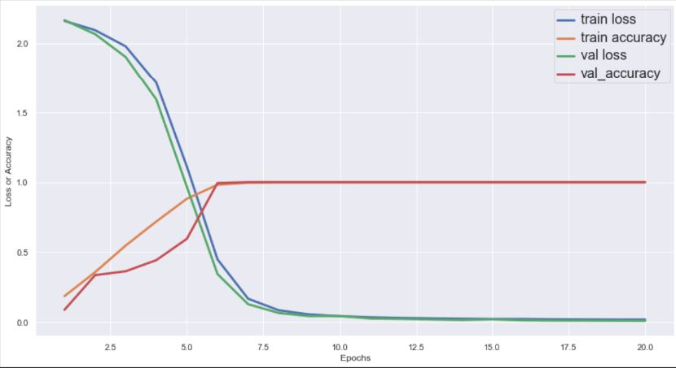

### Project 17- Captcha Detection System using Deep Learning and OpenCV 

    

Description:

This repository contains Python coded source codes for:
 
 
* The implementation of a training script that trains a LeNet architecture
 Convoluted Neural Network model on Captcha digits dataset formed from the
  assimilation of captcha images from the EZ-Pass NY website. A training and
   testing accuracy of around 100% was obtained after 20 epochs of training
   . The image below shows the training and testing accuracy and loss trends
    over the predetermined epochs.
 
   

    

   
  
       
The dataset and the main template for the code are courtesy of [Dr. Adrian
 Rosebrock](https://www.linkedin.com/in/adrian-rosebrock-59b8732a/).
       
    
       

Technology Used:

* Python 3

Libraries Used:

* numpy
* seaborn
* Keras
* OpenCV
