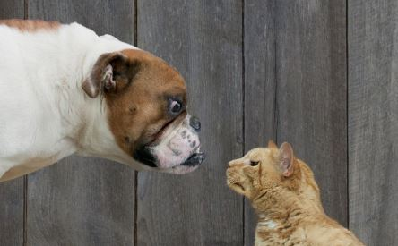
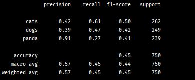

### Project 1: KNN Image Classification on Augmented Animals Dataset

  

Description:

This repository contains source code, implementing the K nearest 
neighborhood algorithm in image classification on an augmented 
version of the Kaggle  [Dogs vs Cats](https://www.kaggle.com/c/dogs-vs-cats) 
dataset with an additional class corresponding to Pandas. There are 
a total of 3000 images in the dataset, with 1000 in each 
category. The model was trained with a 5 neighborhood voting scheme
to obtain an overall test data classification performance as 
depicted in the following picture.

  

It can be observed that an average precision score of around 57% 
was obtained from the trained model. This is in accordance to 
expectation since the KNN algorithm is purely based on the 
calculation of distance metrics and does not really employ 
statistical "learning" to update and improve model parameters as it
parses through the dataset.
   
