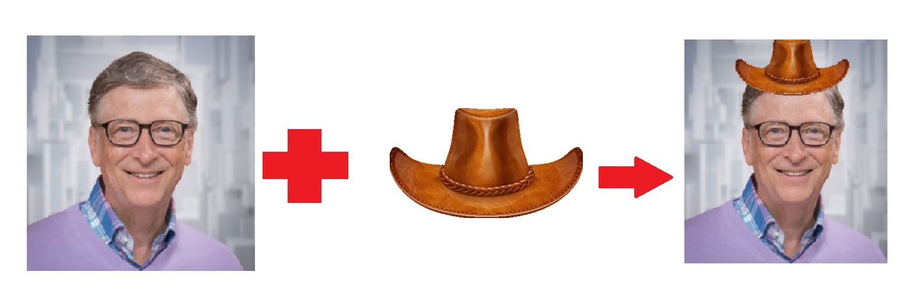

### Project 1- OpenCV Arithmetic Operations and Alpha Channel Masking

    

Description:

This repository contains a jupyter notebook showing implementation of alpha
 channel masking on images via image processing techniques enabled by the
  arithmetic and image extraction functionalities of the OpenCV library
  . Through a fun project, the idea of image masking and superposition is
   presented wherein, a 4 channel image of a hat is superimposed onto the
    image of Bill Gates to artificially place the hat on the head by
     exploiting the alpha channel of the hat image.

Technology Used:

* Python 3

Libraries Used:

* numpy
* OpenCV
