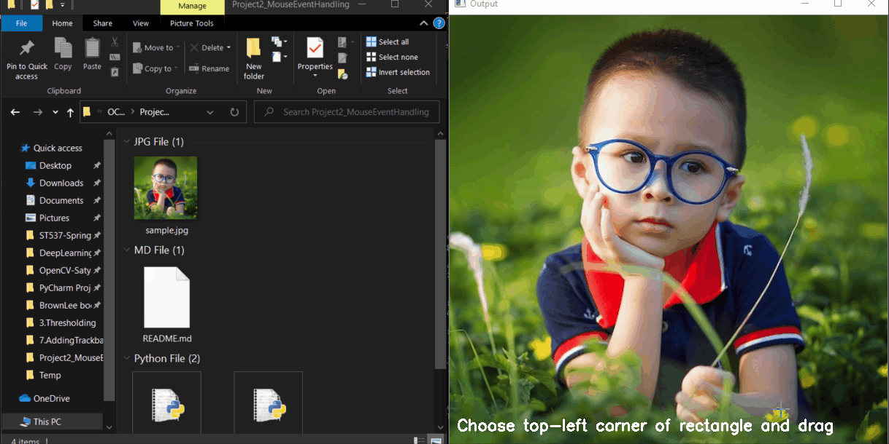

### Project 2- Handling Keyboard and Mouse Events using OpenCV

Description:

This repository contains 2 Python scripts.

 (i)
The `assignment_mouse.py` script serves as source code for the demonstration
 of mouse event handlers in OpenCV. The interaction fo mouse button events
  are used to extract a rectangular region of interest from a given image
   canvas.

    

   (ii) The `submission_trackbar.py` script serves as source code for the
    demonstration of trackbar event handlers in OpenCV. The interaction of
     multiple trackbar events are used to resize a given image canvas as
      follows

 

    

Technology Used:

* Python 3

Libraries Used:

* numpy
* OpenCV